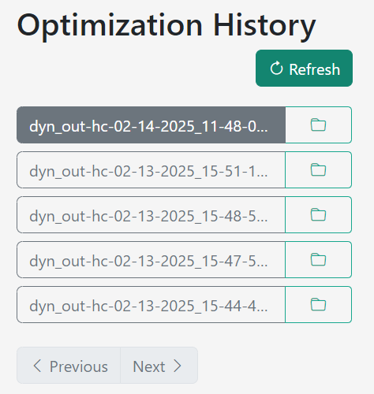

# How to Use the App

## 1. Upload a File  
Click the **"Choose File"** button to upload a CLI file for processing.

  

## 2. Select Material and Printer  
- Choose the appropriate **material type** and **laser printer configuration** from the dropdown menus.
- Users can select and use custom parameters for their own materials or machines.

  
  
  

## 3. View Before Optimization  
Click the **"View"** button to inspect the original CLI file before processing.

  

## 4. Optimize the File  
Click the **"Optimize"** button to reorder the hatch patterns for even heat distribution.

  

## 5. View Processing History  
The **"History"** section lists previously processed files. Click a file name to quickly access it.

  

## 6. Compare Results  
After processing, a **side-by-side comparison** of the original and optimized CLI files will be displayed. Use the **slider** to navigate through layers and examine the hatch patterns.

  
  

## 7. Playback Hatch Sequence  
Use the **playback controls** to animate the hatch sequence and visualize the printing process layer by layer.

Ulendo HC provides an **intuitive, user-friendly** interface for optimizing CLI files. With its advanced **visualization tools** and **playback features**, you can ensure **high-quality** 3D printing results while minimizing deformation risks.
